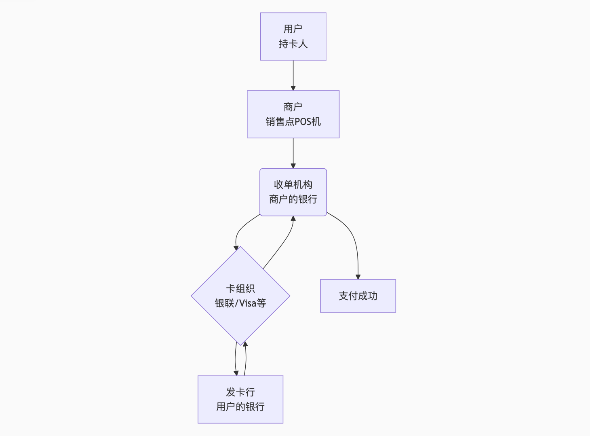

# Payment-document

## Reversal(冲正/撤销)
表示一笔交易被取消，资金退回，就像这笔交易从未发生过。

**核心意思**： 取消一笔之前发生但 **尚未最终结算** 的交易。

**可以理解为**： 交易过程的“回退”或“撤销”操作。

**关键点**： Reversal 是针对一笔未最终完成的交易进行的操作。

常见场景：
- 预授权交易完成后的取消： 最常见于酒店预授权或租车预授权。您入住时，酒店会先冻结一笔押金（显示为消费），当您退房结账后，酒店会取消（Reversal）最初的预授权冻结，这笔钱就会解冻，退回到您的可用额度中。
- 交易出错： 例如，商户重复刷卡、刷卡金额错误，需要撤销其中一笔。
- 系统错误： 由于网络或系统问题，同一笔交易可能被错误地处理了两次，银行会主动撤销其中一笔。

## Credit（贷项/存入/退款）
**核心意思**：有资金存入您的账户，增加了您的余额（如果是借记卡）或减少了您的欠款（如果是信用卡）。

**可以理解为**：一笔实实在在的“进账”。

常见场景：
- 商户退款： 您退货后，商户将款项退回您的信用卡。这时交易描述通常会显示“Credit”或“Refund”。
- 存款或转账存入（针对借记卡）： 有人向您的账户汇款。

举例：
- 您在网上购买了一件300元的衣服，后来选择退货。商家处理退款后，您的信用卡账单上会出现一笔300元的 Credit（退款），这笔钱会用来抵扣您其他消费的欠款。

## 消费过程中的一些流程

#### 授权
在餐厅点菜，服务员记下菜单并先压了你的卡（冻结额度）。交易还未发生，只是确认你有支付能力。
- 动作： 您在POS机刷卡、扫码支付或输入卡号在线支付。
- 后台发生什么： 商户的收单机构向您的发卡行发送请求，询问：“这张卡是否有效？额度够不够支付100元？”
- 发卡行的反应： 发卡行会暂时冻结（Block） 这100元的信用额度（信用卡）或账户余额（借记卡），并回复：“批准（Approved）”。
- 此时状态： 这笔钱你还不能动用，但并没有实际划走。它只是一笔“待处理交易”或“预授权”。这时最容易发生我们前面提到的 Reversal（冲正）。

#### 清算（Clearing）
你吃完饭后，服务员把账单拿给你，你确认金额并签字。双方就最终金额达成一致。
- 动作： 通常在每个营业日结束时，商户会操作POS机或支付系统进行“结算”。
- 后台发生什么： 商户当天所有已授权但未结算的交易会被打包成一个“批次（Batch）”，发送给收单机构进行资金清请。

#### 结算（Settlement）
餐厅拿着你签字的账单，去收银台完成收款，钱正式从你的卡转到餐厅的账户。资金实际转移，交易落袋为安。

## 从消费到最终结算的完整流程
### 第1步：授权（Authorization）
- 动作： 您在POS机刷卡、扫码支付或输入卡号在线支付。

- 后台发生什么： 商户的收单机构向您的发卡行发送请求，询问：“这张卡是否有效？额度够不够支付100元？”

- 发卡行的反应： 发卡行会暂时冻结（Block） 这100元的信用额度（信用卡）或账户余额（借记卡），并回复：“批准（Approved）”。

- 此时状态： 这笔钱你还不能动用，但并没有实际划走。它只是一笔“待处理交易”或“预授权”。这时最容易发生我们前面提到的 Reversal（冲正）。

### 第2步：清批（Batching） - “打包快递”
- 动作： 通常在每个营业日结束时，商户会操作POS机或支付系统进行“结算”。

- 后台发生什么： 商户当天所有已授权但未结算的交易会被打包成一个“批次（Batch）”，发送给收单机构进行资金清请。

### 第3步：清算（Clearing） - “核对账单”
- 动作： 收单机构将收到的交易批次发送给卡组织（如银联、Visa、Mastercard），卡组织再与各家发卡行进行数据交换和核对。

- 后台发生什么： 各方核对交易信息（卡号、金额、时间等）是否正确无误。这个过程确定了各家银行之间“谁该付给谁多少钱”。

### 第4步：结算（Settlement） - “实际打款”
- 动作： 这是最关键的一步！
  
- 后台发生什么： 根据清算结果，资金通过央行或卡组织的清算网络，从发卡行的备付金账户实际划转到收单机构的账户，然后收单机构再支付给商户。
  
- 此时状态： 到了这一步，交易才算是“最终结算”。 之前被冻结的额度会正式转为实际消费，出现在你的账单上。对于商户来说，钱才真正到了他的银行账户里。

## 消费中各个角色

### 1. 用户
- 角色: 发起支付，资金支出
- 职责: 使用工具发起支付，授权支付

### 2. 商户
- 角色：交易卖方，接受资金
- 职责：通过POS机， 扫码枪等支付终端发起交易请求
  
### 3. POS机/支付终端
- 角色：物理接口，采集支付信息
- 职责：（1）读取卡片信息，或生成扫描二维码；（2）将支付信息加密发送给下个环节。 不处理资金，支付中采集信息
- 

### 4. 支付系统
- 角色： 商户内部交易处理软件，通常与POS机集成
- 职责：将支付指令打包，通过收单机构发送出去，可理解为“收银系统”

### 5. 收单机构
- 角色：商户的金融服务提供商，是商户与支付网络的桥梁
- 职责：
  - 为商户开账户，安装POS机
  - 接受商户的支付请求，转发给卡组织
  - 将最终结算资金划拨到商户的英航账户（入账）
  - 处理商户端交易争议，风险
- 常见实体：银行，第三方支付公司：支付宝，微信支付

### 6. 卡组织
- 角色：支付网络的建设或运营者，是链接发卡行和收单机构的桥梁
- 职责：
    - 制定交易规则和技术标准
    - 在发卡行和收单机构之间传递，清分交易信息（清算）
    - 负责不同银行之间的资金划转（结算）
- 实体：银联，Visa, Mastercard等

### 7. 发卡行
- 角色：用户的银行，是支付资金的最终来源
- 职责：
  - 向用户发行银行卡
  - 验证交易的真是性和用户可用余额
  - 对合法交易进行扣款（或冻结额度）
  - 承担用户的信用风险，并向用户提供账单和服务
- 实体：用户持有期银行卡的任何银行

## 消费流程

### 1. 授权请求流：
- 用户在商店购买商品，刷卡/扫码。
- POS机读取卡信息，通过支付系统将交易请求发送给收单机构。
- 收单机构将请求打包，通过卡组织的路由，送到发卡行。
- 发卡行检查卡状态、余额/额度、风险后，决定批准或拒绝，并原路返回响应。
- 响应最终传回POS机，显示“支付成功”或“交易失败”。

### 2. 资金结算流
- （通常在交易发生后的深夜）卡组织会进行清算，算出净额：收单机构今天应该从发卡行收到多少钱。
- 接着进入结算：发卡行将资金划给卡组织，卡组织再划给收单机构。
- 最后，收单机构扣除自己的手续费后，将资金存入商户的银行账户。这个过程通常需要 T+1 个工作日（即第二天到账）。